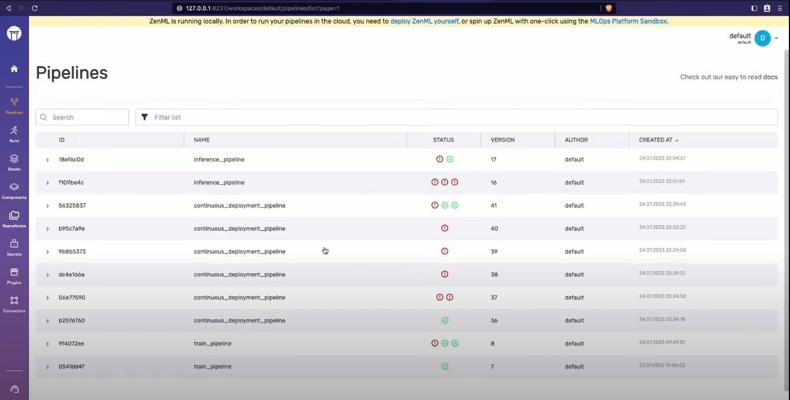

# Customer Satisfaction MLOps Project

</br>
<div align="center">
<a href="https://www.python.org/"></a>
<a href="https://www.zenml.io/"></a>
<a href="https://streamlit.io/"></a>
<a href="https://scikit-learn.org/stable/"></a>
<a href="https://pandas.pydata.org/"></a>
<a href="https://numpy.org/"></a>
</div>

</br>

## Overview

- This repository is the result of following [this tutorial](https://www.youtube.com/watch?v=-dJPoLm_gtE) from Freecodecamp regarding an implementation of an MLOps project
- The purpose of following this tutorial was to strengthen my machine learning skills and to learn about an area I have nascent knowledge but which I understand is important to the machine learning process, which is MLOps

## Problem / Solution Brief

- The purpose of this model is to predict a customer's review score for their next order or purchase
- The dataset to be used is the [Brazilian E-Commerce Public Dataset by Olist](https://www.kaggle.com/datasets/olistbr/brazilian-ecommerce), which contains 100,000 orders made from multiple marketplaces in Brazil between 2016 and 2018, and includes features such as order status, price, payment, freight performance to customer location, product attributes, and customer written reviews
- In order to achieve this prediction, several model architectures have been developed, including a [Random Forest](https://www.ibm.com/topics/random-forest#:~:text=Random%20forest%20is%20a%20commonly,both%20classification%20and%20regression%20problems.), [LightGBM](https://lightgbm.readthedocs.io/en/stable/), [XGBoost](https://xgboost.readthedocs.io/en/stable/), and [LinearRegression](https://www.ibm.com/topics/linear-regression#:~:text=Resources-,What%20is%20linear%20regression%3F,is%20called%20the%20independent%20variable.)
- Due to the nature of the problem, and the possibility of future reviews by customers influencing the decision making of the model, a CI/CD pipeline is necessary to ensure the continuous accuracy and effectiveness of the model

## Content

### Training Pipeline

Our standard training pipeline consists of several steps:

- `ingest_data`: This step will ingest the data and create a `DataFrame`.
- `clean_data`: This step will clean the data and remove the unwanted columns.
- `train_model`: This step will train the model and save the model using [MLflow autologging](https://www.mlflow.org/docs/latest/tracking.html).
- `evaluation`: This step will evaluate the model and save the metrics -- using MLflow autologging -- into the artifact store.

### Deployment Pipeline

We have another pipeline, the `deployment_pipeline.py`, that extends the training pipeline, and implements a continuous deployment workflow. It ingests and processes input data, trains a model and then (re)deploys the prediction server that serves the model if it meets our evaluation criteria. The criteria that we have chosen is a configurable threshold on the [MSE](https://scikit-learn.org/stable/modules/generated/sklearn.metrics.mean_squared_error.html) of the training. The first four steps of the pipeline are the same as above, but we have added the following additional ones:

- `deployment_trigger`: The step checks whether the newly trained model meets the criteria set for deployment.
- `model_deployer`: This step deploys the model as a service using MLflow (if deployment criteria is met).

In the deployment pipeline, ZenML's MLflow tracking integration is used for logging the hyperparameter values and the trained model itself and the model evaluation metrics -- as MLflow experiment tracking artifacts -- into the local MLflow backend. This pipeline also launches a local MLflow deployment server to serve the latest MLflow model if its accuracy is above a configured threshold.

The MLflow deployment server runs locally as a daemon process that will continue to run in the background after the example execution is complete. When a new pipeline is run which produces a model that passes the accuracy threshold validation, the pipeline automatically updates the currently running MLflow deployment server to serve the new model instead of the old one.

### Streamlit App

The solution for this project is also encapsulated as a [Streamlit app](https://streamlit.io/), which can be viewed with the following code:

```bash
streamlit run streamlit_app.py
```

## Running the Application

To acquire the relevant Python dependencies, run:

```bash
git clone https://github.com/zenml-io/zenml-projects.git
cd zenml-projects/customer-satisfaction
pip install -r requirements.txt
```

Starting with ZenML 0.20.0, ZenML comes bundled with a React-based dashboard. This dashboard allows you to observe your stacks, stack components and pipeline DAGs in a dashboard interface. To access this, you need to [launch the ZenML Server and Dashboard locally](https://docs.zenml.io/user-guide/starter-guide#explore-the-dashboard), but first you must install the optional dependencies for the ZenML server:

```bash
pip install zenml["server"]
zenml up
```

If you are running the `run_deployment.py` script, you will also need to install some integrations using ZenML:

```bash
zenml integration install mlflow -y
```

The project can only be executed with a ZenML stack that has an MLflow experiment tracker and model deployer as a component. Configuring a new stack with the two components are as follows:

```bash
zenml integration install mlflow -y
zenml experiment-tracker register mlflow_tracker --flavor=mlflow
zenml model-deployer register mlflow --flavor=mlflow
zenml stack register mlflow_stack -a default -o default -d mlflow -e mlflow_tracker --set
```

You can run two pipelines as follows:

- Training pipeline:

```bash
python run_pipeline.py
```

- The continuous deployment pipeline:

```bash
python run_deployment.py
```

## Screenshots

### Dashboard Homepage


### Pipelines



### DAG Visualiser


### Streamlit App


